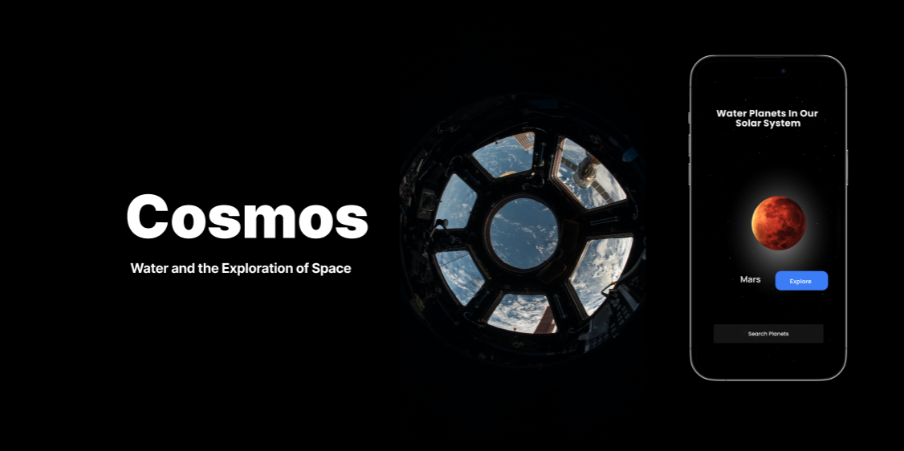
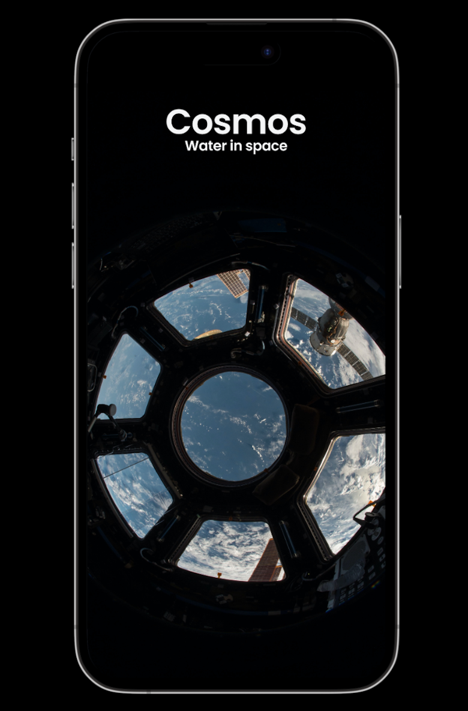
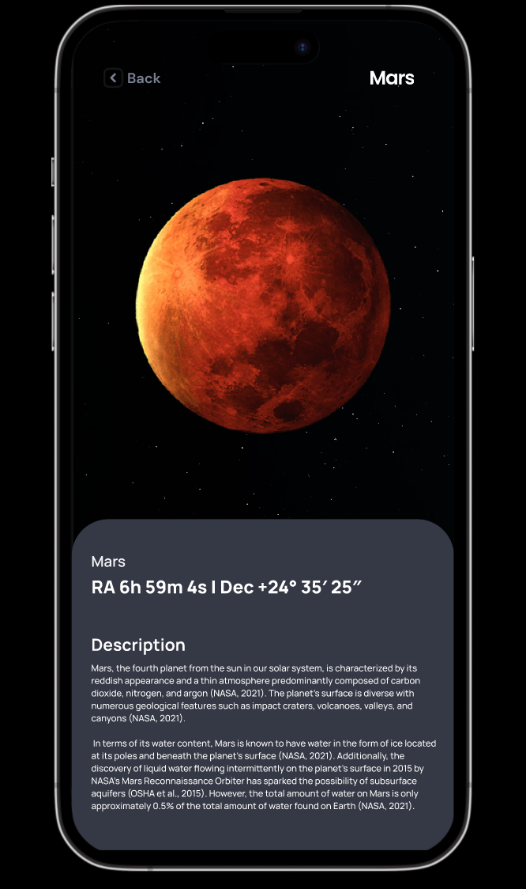

# Cosmos - Water And The Exploration Of Space

The Cosmos application aims to provide learners with a comprehensive understanding of the 
solar system and its components, with a particular focus on the role of water in different planets. 
 

## View Prototype

<a href="https://www.figma.com/proto/cW9bGVNvBo9t2KtRiGRwou/Cosmos---Water-And-The-Exploration-Of-Space?node-id=350-103&scaling=scale-down&page-id=0%3A1&starting-point-node-id=350%3A103"></img></a>
 
 

## Design
 

 
 

## License

Licensed under the [European Union Public License 1.2](https://joinup.ec.europa.eu/collection/eupl/eupl-text-eupl-12)
