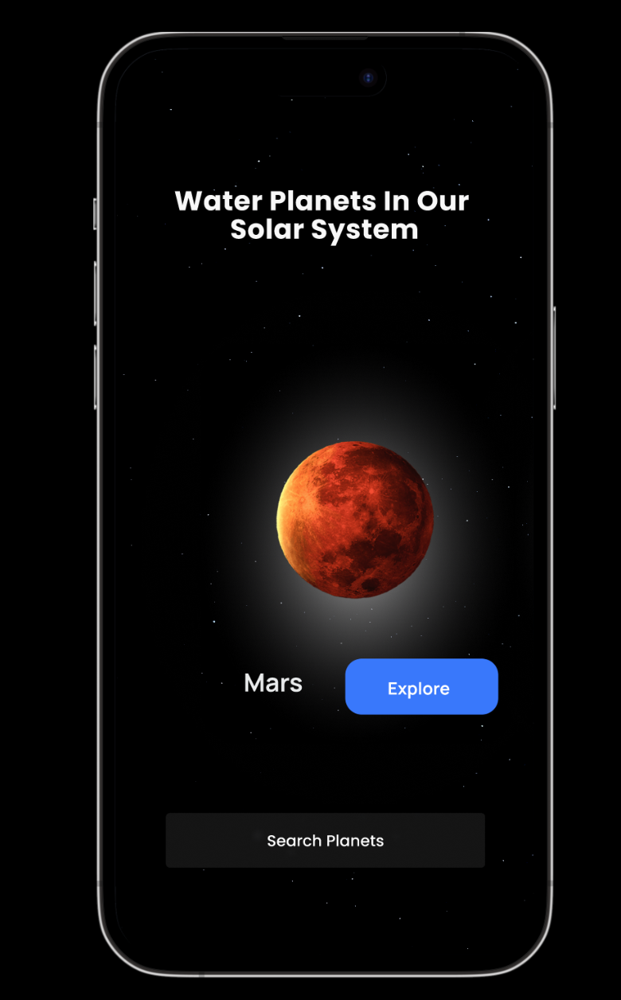

# Cosmos - Water And The Exploration Of Space

The Cosmos application aims to provide learners with a comprehensive understanding of the 
solar system and its components, with a particular focus on the role of water in different planets. 
 

Made with Centria UAS Scholars 

## Design

 

 
 
